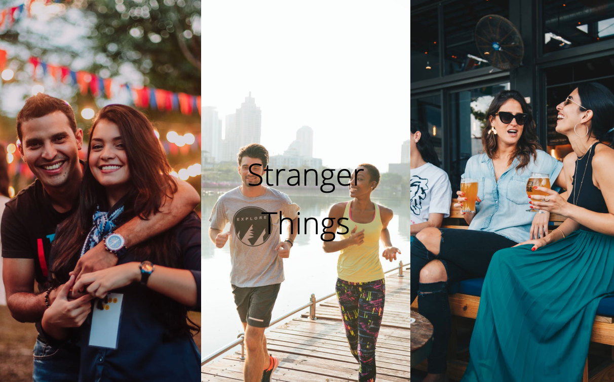
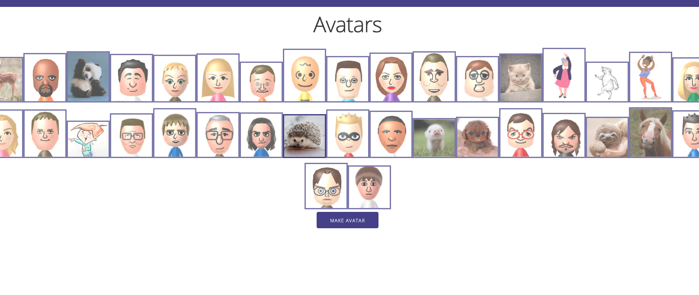
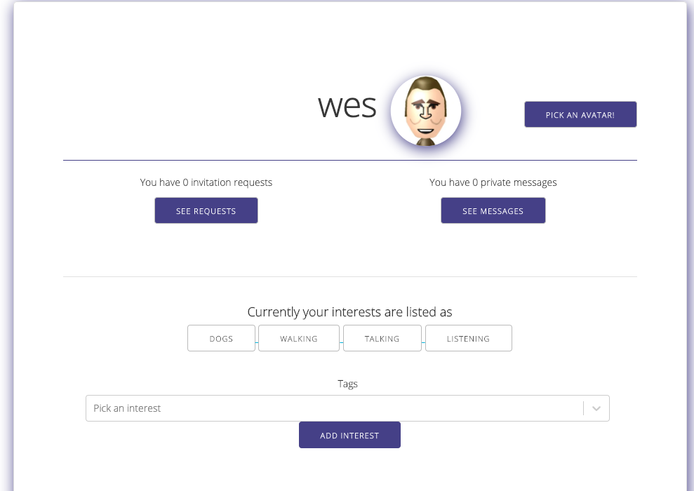
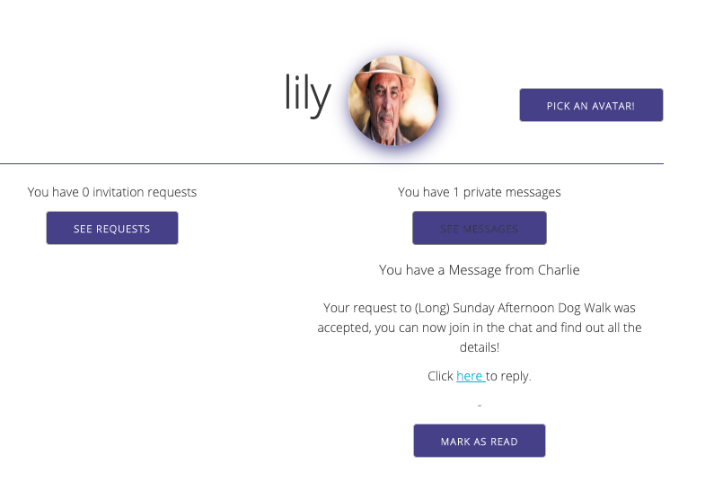
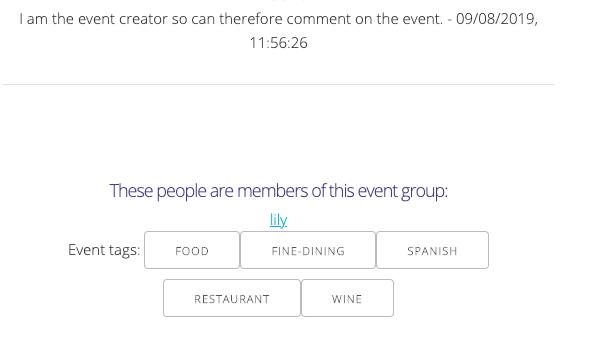
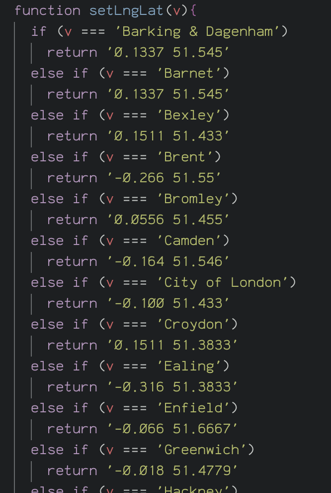
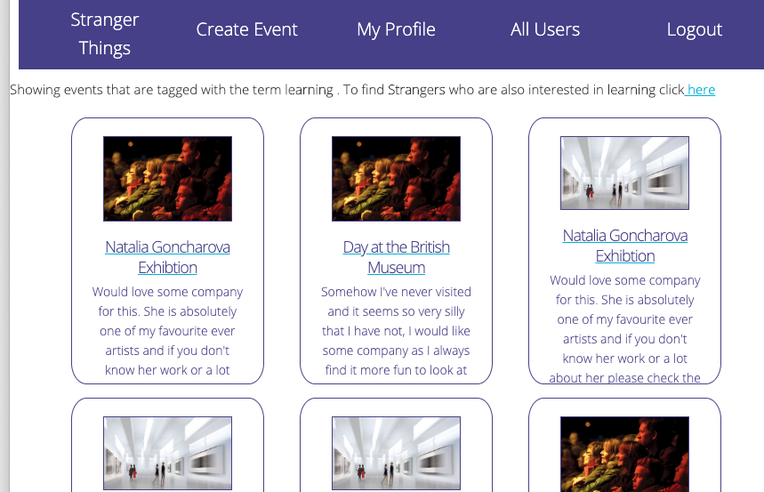

# Stranger Things

A full-stack MERN (Moongoose, Express, React, Node.js) app developed as part of a group over one week.
The project brief was to create a full stack application that met the following criteria:

* **Use an Express API** to serve your data from a Mongo database
* **Consume your API with a separate front-end** built with React
* **Be a complete product**  CRUD functionality
* **Have a visually impressive design**
* **Be deployed online**
* **Have automated tests**


**The Team**

Ola - [leealex88 · GitHub](https://github.com/leealex88)
Lily - [Lily-La-Day · GitHub](https://github.com/Lily-La-Day)
Charles - [CPrich905 · GitHub](https://github.com/CPrich905)

#### Technologies used

||||
|--- |--- |--- |
|React|JavaScript(ES6)|SCSS|
|GitHub|MongoDB|Mongoose
|Node.js|Webpack|Yarn
|bcrypt|jsonwebtoken|axios
|body-parser|file-loader|

#### Mapbox API

The application uses a third party API within the event show pages. This page displays a map of the area where the event is taking place.

## Deployment

The app is deployed on Heroku and it can be found here: https://stranger--things.herokuapp.com/

## Getting Started and How It Works

If you would like to download this repository and run the code yourself simply click to "clone" and then in the terminal enter the following commands:

```
<!-- to install packages: -->
$ yarn
<!-- to get the database up and running: -->
$ mongod
<!-- Run the frontend in your localhost: -->
$ yarn serve:front
<!-- Run the backend in your localhost: -->
$ yarn serve:back
<!--Then to seed the database: -->
$ yarn seed
```





### Overview and User Experience

Once registered and logged in:

Users can:
* View events.
* View events filtered by tagged category and view users whose interests match these tags.
* Request to be accepted into an event.
* View comments that have been posted by members of events on the event pages.
* Will be alerted by private message when a request is accepted.
* Once accepted they can post on the event pages themselves and see private details of the events.
* Can send private messages to other users and receive messages themselves.

They can also:

* Create their own event.
* As an event "host" they will receive notifications of interest from other users.
* As host they can either accept or decline these requests.
* They can also add tags to their own event.
* Can comment on their own event.

We wanted the app to act as platform via which people could not only find events but also find friends, the idea being though that the emphasis is very much on platonic friendship. We therefore chose not to allow users to upload photos but instead had them choose an avatar.



### The Process

I was responsible for the majority of the back-end and most of the frontend components other than those that made up the create event form while my team mates concentrated on the (very large and complicated) event create form, the styling and thorough testing.


#### Challenges

**Viewing Messages/Requests and Responding**


One of the biggest challenges was in displaying user messages/requests to users on their own profile, differentiating between the two private message types and allowing the user to respond accordingly, thus deleting the message and sending an acceptance to the guest.




This was the message schema, as can be seen here requests and other private messages were just variants of this same schema.

```js
const privateMessageSchema = new mongoose.Schema({
  text: { type: String },
  read: { type: Boolean, default: false },
  request: { type: Boolean, default: false },
  requestEvent: { type: mongoose.Schema.ObjectId },
  user: { type: mongoose.Schema.ObjectId, ref: 'User', required: true }
}, {
  timestamps: true
})

```

 


 I have already referenced the backend functions involved in the process of accepting a user as an attendee of an event. The snapshot of code below shows how the messages were filtered.

```js

                {user.privateMessages.forEach(message => (
                  <p key ={message._id} > {message} </p> ))}
                <p> You have {user.privateMessages.filter(message => message.request === true).length} invitation requests </p>
                <button className="buttonEvent" onClick={this.requestFunction}>See Requests</button>

                {this.state.requests && user.privateMessages.filter(message => message.request === true).map((request, i) =>
                  <Request key={i}
                    request={request}
                    user={user}
                    getEventData={this.getData}
                    toggleRequests={this.requestFunction}
                  />
                )}

```

Due to the event set-up whereby we had hosts, non-attending users and attending users it was necessary to use a lot of conditional rendering.

As viewed by a non-attender:




Once a user had been accepted into an event or if they are the event host the event page itself is then displayed differently to them. They can add tags, comment and see private details:


We had two core models, events and users. The event schema had many fields, most of which were optional as we wanted to allow users as much flexibility as possible when creating events.

I enjoyed exploring the Mongoose documentation and was very happy to discover that is was possible to use functions as values with in the schema. I took advantage of this in order to allow users to enter a London Borough as a location that would then be converted in to a LngLat co-ordinate in order to be used by the Mapbox API.

While I usually love a good function, creating the one used to achieve this was not a very love-able experience due to the sheer tedium of having to copy 32 co-ordinates as strings (as input and output data types had to be the same), matching them to the corresponding boroughs.

Just a little snapshot:

<th><p align="center"></p></th>


I realised afterwards that there hadn't been the need for such a degree of precision as I had thought, where I used this method to extract the LngLat for MapBox:

```js
const lng = parseFloat(this.props.locations.location.slice(0,6))
const lat = parseFloat(this.props.locations.location.slice(7,13))
```

I could have split and then joined, which would have been much simpler and would
have negated the necessity of ensuring all decimals were to the same number of points. Oh well!

**Relationships**

From the outset the plan for our application relied heavily on relationships between users and events. I did not consider the implications of this in full when making the event model and due to my own inexperience and lack of Mongoose knowledge did not realise/consider that adding this field:

```js
const attendeeSchema = new mongoose.Schema({
  user: { type: mongoose.Schema.ObjectId, ref: 'User', required: true },
  accepted: { type: Boolean, default: false }
})
```

was an option.

Instead I added an "Events" field to the User model and then when users were accepted:


```js
function acceptRequest(req, res){
  req.body.user = req.currentUser
  User
    .findById(req.params.id)
    .populate('user')
    .then(user => {
      if (!user) return res.status(404).json({ message: 'Not found' })
      user.events.push(req.body.events)
      return user.save()
    })
    .then(user => res.status(201).json(user.events))
    .catch(err => res.json(err))

}
```

The event ID was added to the user's event array.

Thus allowing for this function to be used to get a list of attending users:

```js
function attendingUsers(req, res) {
  User
    .find({ events: req.params.id })
    .then(users => {
      if (!users) return res.status(404).json({ message: 'Not found' })
      res.status(200).json(users)
    })
    .catch(err => console.log(err))
}
```


### Wins and Key Learnings

**Tags and Interests**

Each user and each event has a tags and interests array respectively. It is this that allows us to filter events but it also gives us the potential to be able to match users to events and to each other based on these matching interests. I was very happy to have implemented this functionality (slightly at the last minute!) as it give us a lot of potential for futher additions.



I learnt a lot over the course of this project and felt by the end that I had reached a really positive level of familiarity with the technologies involved and the processes involved in developing all parts of a full-stack MERN application. I found the Mongoose documentation particularly interesting and am excited to explore it further and to see what else is possible now that I have this solid foundation from which to learn more. This project gave me such an insight into how exciting database creating and manipulation can be and it has really sparked an interest in back-end development. 


**Future additions and improvements**

Aside from the things already covered, the area upon which I would like to build is the social side of the site. I would like to add functionality so that users might like events whether they wish to attend or not. The idea being that we can get to know users very well if we keep track of the events they like and those they attend. As we would collect the "tags" associated with the events as the user interacted with them.

With a large event and user base it would then be possible to match people based on their likes and interests, with both events and each other.

I do also recognise that my code is very messy in some places and I would very much like to go back through each component and refactor, re-format and deconstruct where possible.

